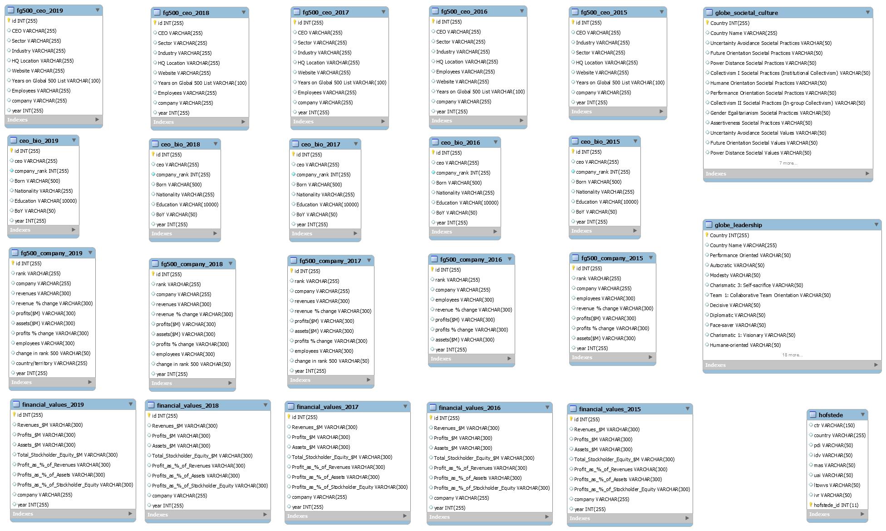

# CEO Culture Project

1. Question

- How does a CEO’s cultural background impact company performance?

2. Project Goal

Analyze and develop a data-driven visualization tool to see the potential impacts of a CEO’s cultural background on the company’s financial performance based on Net Profit Margin and to provide investment-related insights to investors
  - 2.1. Build a cloud-based end-to-end data workflow	
  - 2.2. Develop Machine Learning models both manually and by using Amazon Web Service’s new automated machine learning tool, SageMaker, then compare the results
  - 2.3. Create a data-driven analysis using Tableau’s visualization tool

3. Milestones / Timeline
  
- 3.1. Concept Development
  
- 3.2. Data Collection
  
- 3.3. Data Pipeline Architecture
  
- 3.4. Analytics / Visualization

4. Data Source
  
- 4.1. Company Information: [Fortune Global 500](https://fortune.com/global500/2019/search/)  

- 4.2. CEO Information: [Google Search](https://www.google.com)
  
- 4.3. Globe Leadership & Society Culture: [The GLOBE (Global Leadership and Organizational Behavior Effectiveness) research program](https://globeproject.com/study_2004_2007)
  
- 4.4. [Hofstede’s cultural 6 dimensions](https://geerthofstede.com)
  

5. Cloud-based Data Workflow

- 5.1. Database

- 5.2. Conceptual Architecture

6. Machine Learning
- 6.1. Target Variable: [Net Profit Margin](https://www.investopedia.com/terms/n/net_margin.asp)

- 6.2. [Manual Machine Learning](ML/Manual_ML.ipynb)
 
- 6.3. Cloud Auto Machine Learning: AWS SageMaker

  
7. [Visualization](Tableau)
